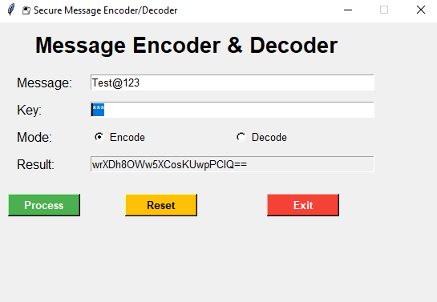

# 🔐 Secure Message Encoder/Decoder – Python GUI App

A lightweight desktop application built with **Python** and **Tkinter** to securely encode and decode messages using a custom key-based algorithm and Base64 encoding.

---

## 🚀 Features
- 🔑 Symmetric key encryption and decryption  
- 🧠 Custom algorithm using character shifting + Base64 encoding  
- 🖥️ Simple GUI built with Tkinter (no command line needed)  
- 📋 Real-time results with Copy, Reset, and Exit options  
- 📝 Supports both **encryption** and **decryption** with user-defined keys  

---

## 📸 Screenshots
*(Add your screenshot here for better presentation)*  



---

## 🛠️ Tech Stack
- **Language:** Python 3.x  
- **GUI Framework:** Tkinter  
- **Encoding:** Base64 (with custom key-based shift logic)  

---

## 📦 Installation & Usage

### 1. Clone the repository
```bash
git clone https://github.com/yourusername/message-encoder-decoder.git
cd message-encoder-decoder
```

### 2. (Optional) Create a virtual environment
```bash
python -m venv venv
source venv/bin/activate   # On Linux/Mac
venv\Scripts\activate    # On Windows
```

### 3. Install dependencies
```bash
pip install -r requirements.txt
```

### 4. Run the application
```bash
python encode-decode.py
```

---

## 🧪 Example

- **Message:** `Hello Ravi`  
- **Key:** `1234`  

🔹 **Encode →** `gAAAAABn...` (encrypted text)  
🔹 **Decode →** `Hello Ravi` (original message)

---

## ⚠️ Note on Security
This project is intended for **learning/demo purposes**.  
The algorithm uses a simple key-shift + Base64 approach and is **not suitable for production security**.  
For real-world applications, consider strong encryption methods like **AES** or **RSA** with the `cryptography` library.

---

## 📂 Project Structure
```
message-encoder-decoder/
│
├── encode-decode.py     # Main Tkinter application
├── screenshot.png       # App UI screenshot (add your own)
├── requirements.txt     # Python dependencies
└── README.md            # Project documentation
```

---

## 📜 License
This project is open-source and available under the [MIT License](LICENSE).
